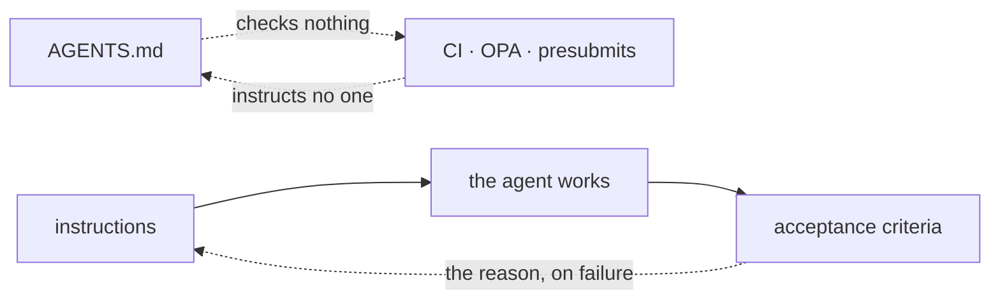

# Instructions and checks

There are two halves to making a team's agents work the same way. You
have to **tell them what to do**, and you have to **check that they did
it**. The industry has converged on excellent answers to each half
separately, and almost nothing that binds them together.

This page is about where Atlas sits in that, and it is written so you
can disagree with it — every claim about somebody else's tool is
sourced.

## The first half: telling them

[**AGENTS.md**](https://agents.md/) is the de-facto standard, and it is
a good one. A Markdown file at the root of a repository describing
build commands, test commands, conventions and boundaries. It is read
natively by Codex, Cursor, Copilot, Gemini CLI, Aider, Windsurf, Zed
and around twenty other tools, it is in **more than 60,000
repositories**, and it is now stewarded by the Agentic AI Foundation
under the Linux Foundation.

Atlas does not compete with it and does not replace it. If your project
has one, keep it.

What it does not have — by design, not by oversight — is any
enforcement. There is no schema, no validation, and nothing that
notices when an agent ignored it. It is a file the model reads and
follows if it happens to.

That is not a criticism of AGENTS.md. It is a description of what a
prompt is. Sixty thousand repositories have written down how they want
agents to work; none of them can tell you whether it happened.

## The second half: checking

This half is mature and has been for years.

**Google** runs its monorepo on presubmits: a change that fails its
tests, its linters, its allowed-dependency rules or its style checks
**cannot be merged**. Their Test Automation Platform handles over
50,000 changes a day and runs more than four billion test cases doing
it. Nothing about it is self-reported.

**[Open Policy Agent](https://www.openpolicyagent.org/docs/cicd)** is
the same idea generalised: write the rule as code, evaluate it in the
pipeline, a `deny` fails the build. It is the right shape, and it is
what Atlas's acceptance criteria are modelled on conceptually — a rule
that an artefact either satisfies or does not.

What this half does not have is any notion of *instructions*. CI does
not tell anyone what to do. It judges what arrived.

## Where Atlas sits

A workflow node carries both halves, bound to the same step:

```yaml
nodes:
  - id: fix-the-defect
    title: Fix the deposit orphaned on reschedule
    instructions: |                          # the first half
      Read issue #187. The deposit row survives a reschedule that
      crosses midnight. Fix it where the transaction is written,
      not where it is read.
    allowedTools: [tracker.*, notes.write]
    maxRetries: 3
    acceptanceCriteria:                      # the second half
      - type: shell
        command: "cargo test -p booking deposit"
```

| | Instructions | Check | Tool scope | Failure fed back |
|---|---|---|---|---|
| AGENTS.md | whole repo | — | — | — |
| CI · OPA · presubmits | — | ✅ | — | — |
| An Atlas node | **per step** | ✅ | ✅ | ✅ |

<DiagramCanvas>



</DiagramCanvas>

The left and right boxes are each mature and neither knows about the
other. The third is the same two halves bound to one step, with the
arrow that closes the loop between them.

Two of those columns are differences in kind rather than degree.

**Granularity.** AGENTS.md describes a repository. A node describes
*this step* — what to do, which tools it is about, and what has to be
true before the next one starts. A house manual versus a work order.

**The loop closes.** When a criterion fails, the reason goes back into
the agent's context and the node is dispatched again. CI cannot do
this: it goes red and waits for a person to read it. That is correct
for CI, whose author is a human who already knows the standard, and
wrong for an agent, which will produce the same output again unless
something tells it what was wrong.

## What this does not claim

**Atlas does not gate your merge.** A node's acceptance criteria stop a
workflow from advancing. They do not stop a push. Today the thing that
keeps non-compliant work out of your default branch is CI plus a
protected branch, exactly as it was before Atlas existed, and that is
the right division: Atlas runs on your machine as you, and a tool that
can block your whole team's merges is no longer a local one.

**Nothing forces anyone to use Atlas.** A developer can open a terminal,
write code and push it without a workflow ever running. The boundary is
the operating system — see [Trust model](/concepts/trust-model) — and
Atlas will not pretend otherwise.

What a declared workflow buys is that **the rules are the same either
way**. Somebody using Atlas meets them at the step where they failed;
somebody who is not meets them at the merge. Nobody satisfies a
different version of the rule, because there is only one version.

## Who owns the coherence between the two halves

A node that says "refactor this" with a criterion of `cargo test` is
not checking what it asked for. It is checking that nothing broke,
which is a different statement, and it can pass with the work not done.

**That coherence is the author's responsibility, not Atlas's**, and
this is a decision rather than a missing feature.

The alternative would be a criterion that reads the instructions and
judges whether the work matches them — a model grading a model. That
produces a probability, and a gate that is probably right is worse than
no gate: it is the same unverified claim as the agent's own report,
wearing the runtime's authority. Atlas would be doing exactly what it
exists to stop.

So the check on a node's coherence is the one every other design
decision in a repository gets. **The workflow is a committed file**, so
it arrives as a diff, somebody reads it, and "this criterion does not
check what this step asked for" is a review comment like any other. It
is the cheapest review there is — two fields, next to each other, in
one file.

What Atlas guarantees is narrower and worth stating exactly: **a
declared criterion was executed by the runtime and passed.** Whether it
was the right criterion is a judgement, and judgement is the half a
person keeps.

This is the same line the [trust model](/concepts/trust-model) draws
everywhere else. Atlas enforces what is mechanical and says so; it does
not dress a heuristic up as a boundary.

## Sources

- [AGENTS.md](https://agents.md/) — the format, its adoption and its stewardship
- [Software Engineering at Google, ch. 23 — Continuous Integration](https://abseil.io/resources/swe-book/html/ch23.html) — presubmits, TAP, and why heterogeneous checks are a tax
- [Open Policy Agent in CI/CD pipelines](https://www.openpolicyagent.org/docs/cicd) — policy as code as a build gate
