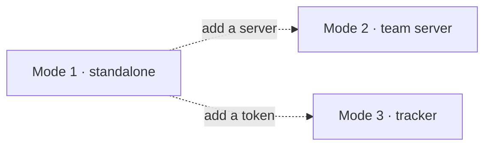

# Operating modes

Atlas has three modes, and they **stack** rather than replace each
other. You are always in Mode 1; the other two are things you switch
on.

| | What it adds | What it costs |
|---|---|---|
| **Mode 1 — standalone** | Everything: sessions, terminals, messaging, workflow runs, agent memory | Nothing. No account, no server, no network |
| **Mode 2 — team server** | Your state on a machine you host, reachable from your other laptop and your teammates | A server to run, and accounts on it |
| **Mode 3 — tracker bridge** | Issues read and written in GitLab or GitHub | A token, kept in your own config |

Mode 2 and Mode 3 are independent. A solo developer who wants issues
runs 1 + 3. A pair working on one machine's server without a tracker
runs 1 + 2. Neither implies the other.

<DiagramCanvas>

</DiagramCanvas>

The dotted arrows are the point: they are additions to Mode 1, not
migrations away from it, and neither passes through the other.

## Mode 1 is the whole product

This is the part most tools get backwards, so it is worth stating
plainly: **standalone is not a trial**. Every feature works with no
account and no server. There is no login screen, because in Mode 1
there is nobody to log in as — accounts are a Mode 2 concept and they
appear when you activate Mode 2, not before.

The practical consequence: nothing you do in Mode 1 has to be migrated
when you add a server later. The sessions you already have replicate as
they are; they were never shaped by the absence of one.

## Mode 2 changes where state lives, not what it is

A team server is another `atlas-server` — the same binary, the same
image — that your machines sync against. It is not a different product
and it holds no privileged position beyond being the one everyone can
reach.

Two things replicate, and they replicate differently:

- **Project state** — shared, because it is about work everyone on the
  project is doing.
- **Personal state** — replicated **marked private to you**. It goes to
  the server so your second laptop can have it and your dead disk does
  not lose it, and it stays yours there: no admin view, no reporting
  query that includes it.

That distinction is not a runtime setting. It is a column on every row,
enforced in the schema — see [State and privacy](/concepts/state-and-privacy).

How eagerly your machine syncs is *your* choice, per machine, changeable
without a restart: manual, polled, or live. Your teammate can be in a
different mode at the same time without either of you noticing. See
[Sync](/concepts/sync).

## Mode 3 bridges, it does not own

With a tracker configured, `tracker.*` tools read and write real issues
in GitLab or GitHub. Atlas keeps a local **read** mirror so an agent
listing issues is not waiting on a round trip, but every write goes to
the real tracker and refreshes the mirror immediately.

That ordering matters: a write is never visible locally before it is
real. The failure mode it avoids is an agent believing it filed an
issue that never left the machine.

Without a tracker configured, the `tracker.*` tools return a clear
"tracker disabled" error rather than failing obscurely, and nothing
else is affected.

## Why three, rather than a single "team edition"

The alternative is one product that assumes a server, and a stripped
demo for people without one. That makes the common case — one developer
on one laptop — the degraded case, and it makes every feature answer
"what happens with no network" as an afterthought instead of by
construction.

Stacking also means the modes can be reasoned about separately. A bug
in sync cannot break standalone, because standalone does not call it.
