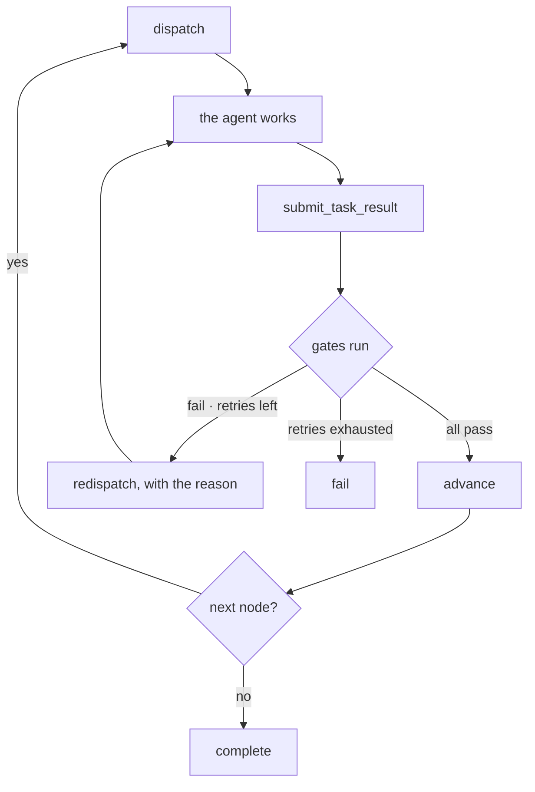

# Workflow runs

A workflow is a graph of nodes. Each node is a task handed to an agent,
and a node only advances when its **acceptance criteria pass** — a
command that exits zero, a payload that matches a schema.

That is the whole point. "The agent said it was done" and "a check
confirmed it" are different claims, and only the second one moves the
run forward.

## Write one

```yaml
name: add-endpoint
description: Add an endpoint and prove it works
nodes:
  - id: implement
    title: Implement the handler
    instructions: |
      Add GET /api/widgets returning a JSON array.
      Keep the existing error envelope.

  - id: test
    title: Cover it
    instructions: Write a test that asserts the shape, then run the suite.
    dependsOn: [implement]
    maxRetries: 2
    acceptanceCriteria:
      - type: shell
        command: cargo test --workspace
        expectExit: 0
        timeoutSecs: 300
```

| Field | | |
|---|---|---|
| `id` | required | Unique within the spec |
| `title` | required | Shown in the timeline |
| `instructions` | required | Free text handed to the agent |
| `dependsOn` | `[]` | Ids that must complete first |
| `acceptanceCriteria` | `[]` | Empty means nothing to check |
| `maxRetries` | `3` | Retries after a failed gate |
| `agentKind` | — | Recorded, not yet used for routing |

A node with no criteria always passes. That is "nothing to check", not
"checked and fine" — the gate is opt-in per node, and it is worth being
deliberate about which nodes carry one.

## The two kinds of criterion

**`shell`** — run a command, check its exit code and optionally match
its output:

```yaml
- type: shell
  command: test -f dist/bundle.js
  expectExit: 0          # default
  cwd: packages/web      # default: the project root
  stdoutMatches: "built in"
  timeoutSecs: 60        # default
```

**`schema-validate`** — JSON-Schema the payload the agent replied with:

```yaml
- type: schema-validate
  schema:
    type: object
    required: [filesChanged, testsAdded]
    properties:
      filesChanged: { type: array, items: { type: string } }
      testsAdded:   { type: integer, minimum: 1 }
```

The first checks the world. The second checks the *report* — useful
when an agent should tell you what it did in a structured way rather
than in prose you then have to parse.

Both run after the agent submits its result, in the order written, and
all must pass.

## Run it

```jsonc
// afg.register_workflow — inline, or source_path relative to project_root
{ "project": "your-org/your-project", "project_root": "/home/you/dev/your-org/your-project",
  "source_path": ".atlas/add-endpoint.yaml" }

// afg.start_run
{ "workflow_id": "01M1T7PY…", "session_id": "01M1T7PP…" }
```

Starting a run dispatches the first runnable node as a **`task` message
on the coordination bus**. The target session's owner picks it up by
reading their own inbox, exactly like any other message — nothing is
injected into a PTY.

The agent works, then reports:

```jsonc
// afg.submit_task_result
{ "run_id": "01M1T7PY…", "node_id": "test", "project_root": "/home/you/dev/your-org/your-project",
  "payload": { "filesChanged": ["src/routes.rs"], "testsAdded": 3 } }
```

Now the gates run. Three outcomes:

- **All pass** → the run advances to the next runnable node, or
  completes.
- **One fails, retries left** → the same node is dispatched again with
  **the failure reason in its payload**, so the agent sees what went
  wrong rather than being told to try again.
- **One fails, retries exhausted** → the run fails.

<DiagramCanvas>



</DiagramCanvas>

The arrow back from **redispatch** is the whole point, and it is the one
CI cannot draw: a failed check does not stop at a red dashboard waiting
for a person, it returns to the agent as context. An agent told only
"it failed" produces the same output again.

## Watch it happen

`afg.get_run` returns a snapshot: status plus the whole event timeline,
oldest first.

To watch instead of poll, stream it — this is a person-facing endpoint,
so it takes an `atlas-auth` bearer rather than the MCP token:

```bash
curl -N -H "Authorization: Bearer $SESSION_TOKEN" \
  http://127.0.0.1:4000/api/afg/runs/$RUN_ID/events
```

```
event: enter
data: {"node_id":"test","kind":"enter","payload":{"title":"Cover it"},…}

event: gate_fail
data: {"node_id":"test","kind":"gate_fail","payload":{"reason":"exit 101"},…}

event: retry
data: {"node_id":"test","kind":"retry",…}

event: complete
data: {"node_id":"test","kind":"complete",…}
```

Connecting **replays the run's history first**, then continues live on
the same connection — so joining a run already in progress shows the
whole timeline, without a second request. The stream closes itself once
the run reaches `complete` or `error`, rather than hanging open on a
run that will never move again.

The event kinds are `enter`, `exec`, `gate_pass`, `gate_fail`, `retry`,
`advance`, `complete`, `error`.

## Where the spec lives

Project workflows belong in the project repository, committed, under
`.atlas/workflows/`. They are something the team agreed on, and they
change with the code they check. Point `source_path` at them.

**The file is the source of truth, not the registration.** Starting a
run re-reads it from disk, so an edit takes effect on the next run
without re-registering — on your machine and on everybody else's, after
a pull. Registering is how you point Atlas at the file; it is not a
copy of the rules.

Two consequences worth stating, because both are deliberate:

- **A run in flight keeps the spec it started with.** Committing a
  change does not rewrite the criteria an agent is already being judged
  against. The next run picks it up.
- **A file that will not parse, or is missing, fails the start.**
  Falling back to the last version that worked would run rules the
  repository no longer contains, silently.

Use the inline `yaml` parameter for one-offs and experiments, where
committing a file would be noise. Inline workflows have no file to
re-read, which is why they are for experiments.

For adopting this across a team — and for what changes when a second
developer clones the repository — see
[A shared way of working](/guide/shared-way-of-working).
